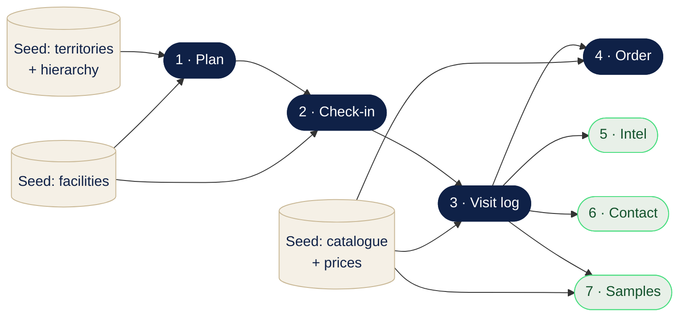

# Dependency Network · Rep Core Loop

The rep core-loop stories of [user-stories.md](user-stories.md) drawn as a **directed acyclic graph** (DAG): nodes are seeds and stories, arrows mean "must exist before." This is simultaneously the requirements map, the build order, and the thing we later cut into milestones. It recomputes as we add stories.

**Legend:** navy = critical path · cream = seeds (reference data loaded once) · green = parallel fan-out. Each story is "done" at its receiving end (Story 2 → RSM feed, 4 → sales-admin queue, 5 → PM feed, 6 → rep pipeline, 7 → sample record); those consumers are internal to their stories, not drawn.

## The critical path

The **critical path** is the longest chain of dependent work. Its length is the minimum project duration *no matter how many developers you add*, because the links can't overlap.

Here it's the spine: **Seeds → Plan → Check-in → Visit log → Order.** Check-in cannot start before Plan exists; the log can't start before check-in; the order can't start before the log. Four stories deep. To go faster you must shorten a step *on the path*, not throw people at it. Adding developers only helps *off* the path.

## The fan-out (where extra hands actually help)

Once **Story 3 (Visit log)** lands, Stories 4, 5, 6, 7 all become buildable and none depends on the others. They fan out and run **concurrently**. This is the point where more developers (or AI agents) genuinely speed things up, and where you can safely hand independent stories to less-trusted contributors: they can't block each other or the spine.

## Risk hotspots (in-degree = blast radius)

Count the arrows *into* each node:
- **Story 3 (Visit log)** has four dependents (4, 5, 6, 7). It's the keystone. If it slips, everything downstream slips. Build it early, review it hardest, staff it with your most trusted people.
- **Seed: catalogue** feeds Stories 3, 4, and 7. A high-value seed. Get it loaded and correct early.
- **Seed: facilities** feeds Stories 1 and 2.

A flat backlog hides these; the graph makes them obvious.

## The build schedule (topological waves)

A valid order is any topological sort. In waves:
- **Wave 0 (seeds):** territories+hierarchy, facilities, catalogue+prices. Data loads, parallel, do first.
- **Wave 1:** Story 1 · Plan
- **Wave 2:** Story 2 · Check-in
- **Wave 3:** Story 3 · Visit log
- **Wave 4:** Stories 4, 5, 6, 7 · Order, Intel, Contact, Samples (parallel)

Milestones are drawn *on top of* these waves afterwards; you cannot slice a graph you haven't built.

## Float / slack

Stories off the critical path have **float**: room to slip without moving the end date. Among the fan-out, Intel and Contact (5, 6) are lighter and carry more float than Order (4), which pulls in the catalogue, prices, and the most downstream machinery and is likely the critical leaf. Float tells you where it's safe to pull a developer off to reinforce the path.

## Staffing rule of thumb

Best/most-trusted people on the **critical path** (it gates everything). Fan-out leaves, being independent and unable to cascade, are the safe place for newer developers and AI agents working small, reviewable tasks.
